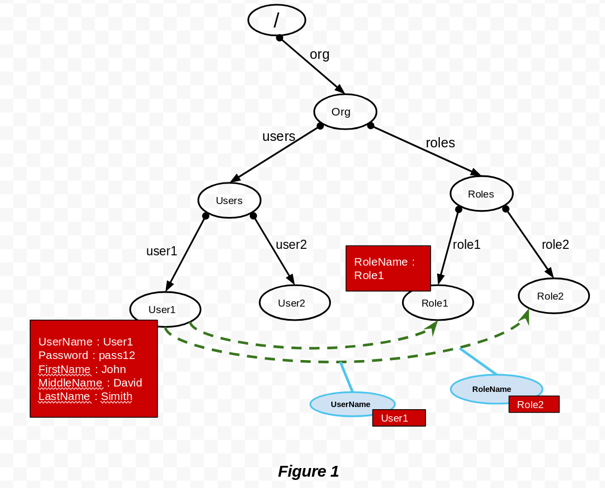
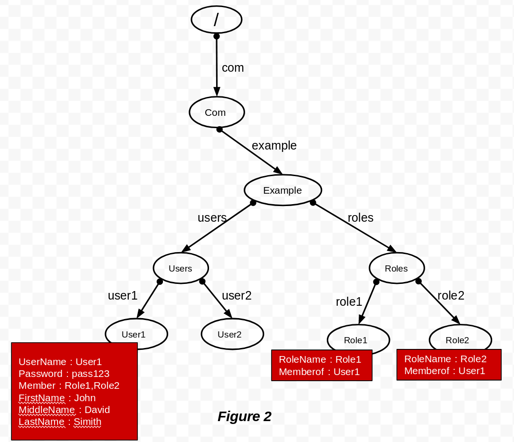

# AWS User Store Extension for WSO2 IS

This extension will allow users to use AWS cloud directory [API Doc](https://docs.aws.amazon.com/clouddirectory/latest/developerguide/what_is_cloud_directory.html) as
the user store for WSO2 IS using [REST API](https://docs.aws.amazon.com/directoryservice/latest/APIReference/welcome.html).
Cloud Directory is a specialized graph-based directory store that provides a foundational building block for developers. With Cloud Directory, we can organize directory objects into multiple hierarchies to support many organizational pivots and relationships across directory information.
This AWS user store extension can be used as both primary and secondary user store for WSO2 IS. This extension is compatible with IS version 5.5.0.

AWS user store manager configured with <b>org.wso2.carbon.aws.user.store.mgt.AWSUserStoreManager</b> user store manager class.

## Prerequisites

As an initial step, end user needs to create the cloud directory by uploading the schema for the objects via AWS console. Please refer sample schema below that is used to configure the sample user store configuration in the following section.
Then obtain the following property values and use it in the AWS user store configuration :  DirectoryArn, SchemaArn, FacetNameOfUser, FacetNameOfRole, UserNameAttribute, PasswordAttribute, MembershipAttribute, RoleNameAttribute, MemberOfAttribute.
<br/><br/>
```json
{
 "facets": {
   "ROLES": {
     "facetAttributes": {
       "RoleName": {
         "attributeDefinition": {
           "attributeType": "STRING",
           "isImmutable": false
         },
         "requiredBehavior": "REQUIRED_ALWAYS"
       },
       "MemberOf": {
         "attributeDefinition": {
           "attributeType": "STRING",
           "isImmutable": false
         },
         "requiredBehavior": "NOT_REQUIRED"
       }
     },
     "objectType": "LEAF_NODE"
   },
   "USERS": {
     "facetAttributes": {
       "UserName": {
         "attributeDefinition": {
           "attributeType": "STRING",
           "isImmutable": false
         },
         "requiredBehavior": "REQUIRED_ALWAYS"
       },
       "Password": {
         "attributeDefinition": {
           "attributeType": "STRING",
           "isImmutable": false
         },
         "requiredBehavior": "REQUIRED_ALWAYS"
       },
       "Member": {
         "attributeDefinition": {
           "attributeType": "STRING",
           "isImmutable": false
         },
         "requiredBehavior": "NOT_REQUIRED"
       }
     },
     "objectType": "LEAF_NODE"
   }
 }
}
```


### Steps to Configure AWS as the Secondary User Store

1. Download the AWS user store extension jar from [WSO2 store](https://store.wso2.com/store/assets/isconnector/list)
2. Copy the downloaded jar and put it into the `IS_HOME/repository/components/dropins` folder.
3. Finally, open a terminal, navigate to the `IS_HOME/bin` folder and start the IS server by executing the following command
   ```bash
      ./wso2server.sh
   ```

4. Now you have successfully added the AWS user store extension to the WSO2 IS. You should see AWS user store listed along with other user stores IS management console UI. Using that you can create a AWS secondary user store and perform your user management operations.

   ```bash
      Main > User Stores > Add
   ```


### Configuring AWS as the Primary User Store

The above configurations are good enough for you to use the AWS as a secondary user store manager. However, in order to use the AWS as the primary user store of WSO2 IS you need some additional configurations as follow.

4. After following steps 1-2, prior to start the IS server, add the following in the `user-mgt.xml` file of WSO2 IS. You can find this file inside `IS_HOME/repository/conf` folder.
   Make sure to replace the following properties.

#### user-mgt.xml

```xml
<UserStoreManager class="org.wso2.carbon.aws.user.store.mgt.AWSUserStoreManager">
    <Property name="TenantManager">org.wso2.carbon.user.core.tenant.JDBCTenantManager</Property>
    <Property name="AccessKeyID">xxxxxxxxxxxxxxxxxxxxxxxxx</Property>
    <Property name="SecretAccessKey">xxxxxxxxxxxxxxxxxxxxxxxxxxxxxxxxxx</Property>
    <Property name="Region">us-west-2</Property>
    <Property name="APIVersion">2017-01-11</Property>
    <Property name="PathToUsers">/com/users</Property>
    <Property name="PathToRoles">/com/roles</Property>
    <Property name="MembershipTypeOfRoles">link</Property>
    <Property name="DirectoryArn">arn:aws:clouddirectory:us-west-2:610968236798:directory/ASc_ZQAllU0Ot0_vpmXmwF4</Property>
    <Property name="SchemaArn">arn:aws:clouddirectory:us-west-2:610968236798:directory/ASc_ZQAllU0Ot0_vpmXmwF4/schema/userstoreSchema/1.0</Property>
    <Property name="FacetNameOfUser">USERS</Property>
    <Property name="FacetNameOfRole">ROLES</Property>
    <Property name="ReadOnly">false</Property>
    <Property name="ReadGroups">true</Property>
    <Property name="WriteGroups">true</Property>
    <Property name="Disabled">false</Property>
    <Property name="UserNameAttribute">UserName</Property>
    <Property name="PasswordAttribute">Password</Property>
    <Property name="MembershipAttribute">Member</Property>
    <Property name="RoleNameAttribute">RoleName</Property>
    <Property name="MemberOfAttribute">MemberOf</Property>
    <Property name="UserNameJavaRegEx">[a-zA-Z0-9._\-|//]{3,30}$</Property>
    <Property name="UserNameJavaScriptRegEx">^[\S]{3,30}$</Property>
    <Property name="UsernameJavaRegExViolationErrorMsg">Username pattern policy violated</Property>
    <Property name="PasswordJavaRegEx">^[\S]{5,30}$</Property>
    <Property name="PasswordJavaScriptRegEx">^[\S]{5,30}$</Property>
    <Property name="PasswordJavaRegExViolationErrorMsg">Password pattern policy violated.</Property>
    <Property name="RoleNameJavaRegEx">[a-zA-Z0-9._-|//]{3,30}$</Property>
    <Property name="RoleNameJavaScriptRegEx">^[\S]{3,30}$</Property>
    <Property name="PasswordHashMethod">PLAIN_TEXT</Property>
    <Property name="MaxUserNameListLength">100</Property>
    <Property name="MaxRoleNameListLength">100</Property>
</UserStoreManager>
```


##### Sample user store configurations and corresponding tree structures for AWS

1. <b>Case 1 :</b> Use typed link to model relationships between different objects(Users, Roles).

    - Sample user store configuration :<br/><br/>
        ``` xml
        <UserStoreManager class="org.wso2.carbon.aws.user.store.mgt.AWSUserStoreManager">
           <Property name="AccessKeyID">AGBMVJTFDRGJKOGFD</Property>
           <Property name="SecretAccessKey">xxxxxxxxxxxx</Property>
           <Property name="Region">us-west-2</Property>
           <Property name="APIVersion">2017-01-11</Property>
           <Property name="PathToUsers">/org/users</Property>
           <Property name="PathToRoles">/org/roles</Property>
           <Property name="MembershipTypeOfRoles">link</Property>
           <Property name="DirectoryArn">arn:aws:clouddirectory:us-west-2:61898:directory/AVLHa3w</Property>
           <Property name="SchemaArn">arn:aws:clouddirectory:us-west-2:61898:directory/AVLHa3w/schema/schema/1.0</Property>
           <Property name="FacetNameOfUser">USERS</Property>
           <Property name="FacetNameOfRole">ROLES</Property>
           <Property name="ReadGroups">true</Property>
           <Property name="WriteGroups">true</Property>
           <Property name="Disabled">false</Property>
           <Property name="UserNameAttribute">UserName</Property>
           <Property name="PasswordAttribute">Password</Property>
           <Property name="MembershipAttribute"/>
           <Property name="RoleNameAttribute">RoleName</Property>
           <Property name="MemberOfAttribute"/>
           <Property name="UserNameJavaRegEx">[a-zA-Z0-9._\-|//]{3,30}$</Property>
           <Property name="UserNameJavaScriptRegEx">^[\S]{3,30}$</Property>
           <Property name="UsernameJavaRegExViolationErrorMsg">Username pattern policy violated.</Property>
           <Property name="PasswordJavaRegEx">^[\S]{5,30}$</Property>
           <Property name="PasswordJavaScriptRegEx">^[\S]{5,30}$</Property>
           <Property name="PasswordJavaRegExViolationErrorMsg">Password pattern policy violated.</Property>
           <Property name="RoleNameJavaRegEx">[a-zA-Z0-9._-|//]{3,30}$</Property>
           <Property name="RoleNameJavaScriptRegEx">^[\S]{3,30}$</Property>
           <Property name="PasswordHashMethod">PLAIN_TEXT</Property>
           <Property name="MaxUserNameListLength">100</Property>
           <Property name="MaxRoleNameListLength">100</Property>
        </UserStoreManager>
        ```
        <br/>
        According to “MembershipTypeOfRoles” property in the above configuration, end user should use a link to model an ownership relationship between the user and role objects.
        So the directory structure will be like <b>Figure 1</b>. For an example If we assign multiple roles such as Role1 and Role2 to User1, then to establish a relationship between
        these objects we will create “typelinks” from User1 → Role1 and User1 → Role2.


    - Tree structure in AWS for the above configuration : <br/><br/>
         
2. <b>Case 2 :</b> Maintain the different objects(Users, Roles) relationship details as an attribute inside the Users and Roles object.
    - Sample user store configuration : <br/><br/>

        ```xml
        <UserStoreManager class="org.wso2.carbon.aws.user.store.mgt.AWSUserStoreManager">
           <Property name="AccessKeyID">AGBMVJTFDRGJKOGFD</Property>
           <Property name="SecretAccessKey">xxxxxxxxxxx</Property>
           <Property name="Region">us-west-2</Property>
           <Property name="APIVersion">2017-01-11</Property>
           <Property name="PathToUsers">/com/example/users</Property>
           <Property name="PathToRoles">/com/example/roles</Property>
           <Property name="MembershipTypeOfRoles">attribute</Property>
           <Property name="DirectoryArn">arn:aws:clouddirectory:us-west-2:61898:directory/AVLHa3w</Property>
           <Property name="SchemaArn">arn:aws:clouddirectory:us-west-2:61898:directory/AVLHa3w/schema/schema/1.0</Property>
           <Property name="FacetNameOfUser">USERS</Property>
           <Property name="FacetNameOfRole">ROLES</Property>
           <Property name="ReadGroups">true</Property>
           <Property name="WriteGroups">true</Property>
           <Property name="Disabled">false</Property>
           <Property name="UserNameAttribute">UserName</Property>
           <Property name="PasswordAttribute">Password</Property>
           <Property name="MembershipAttribute">Member</Property>
           <Property name="RoleNameAttribute">RoleName</Property>
           <Property name="MemberOfAttribute">MemberOf</Property>
           <Property name="UserNameJavaRegEx">[a-zA-Z0-9._\-|//]{3,30}$</Property>
           <Property name="UserNameJavaScriptRegEx">^[\S]{3,30}$</Property>
           <Property name="UsernameJavaRegExViolationErrorMsg">Username pattern policy violated.</Property>
           <Property name="PasswordJavaRegEx">^[\S]{5,30}$</Property>
           <Property name="PasswordJavaScriptRegEx">^[\S]{5,30}$</Property>
           <Property name="PasswordJavaRegExViolationErrorMsg">Password pattern policy violated.</Property>
           <Property name="RoleNameJavaRegEx">[a-zA-Z0-9._-|//]{3,30}$</Property>
           <Property name="RoleNameJavaScriptRegEx">^[\S]{3,30}$</Property>
           <Property name="PasswordHashMethod">PLAIN_TEXT</Property>
           <Property name="MaxUserNameListLength">100</Property>
           <Property name="MaxRoleNameListLength">100</Property>
        </UserStoreManager>
        ```
        <br/>
        According to “MembershipTypeOfRoles” property in the above configuration, end user should use an attribute to keep an ownership relationship between the user and role objects.
        So the directory structure will be like <b>Figure 2</b>. For an example if we assign multiple roles such as Role1 and Role2 to User1 then the relationship between these object
        will be kept as an attribute inside the objects (Using Member attribute in Users object and Memberof attribute in Roles object) itself.


    - Tree structure in AWS for the above configuration : <br/><br/>
         


In the above two cases, set of additional attributes will be kept inside each object such as,<br/>
    For user object - UserName, Password and set of claims. <br/>
    For role object - RoleName.

<br/><br/>
#### Properties used in AWS userstore manager

<br/>

| Property | Description |
| ------------- |-------------|
| AccessKeyID | AWS access key ID |
| SecretAccessKey | AWS secret access key |
| Region | Region which is used to select a regional endpoint to make API requests |
| APIVersion | Cloud directory API version |
| PathToUsers | This is a path to identify the “Users” object in the tree structure. <br/><br/> A child link creates a parent–child relationship between the objects it connects. For example, in the above illustration(Figure 1) child link 'users' connects objects Org and Users. Child links have names when they participate in defining the path of the object that the link points to. So to construct the path for the "Users" object, use the link names from each parent/child link. Path selectors start with a slash (/) and link names are separated by slashes. <br/><br/> /some/path - Identifies the Users object based on path. <br/><br/> Eg :- For the above illustrated(Figure 1) tree structure PathToUsers will be /org/users |
| PathToRoles | This is a path to identify the “Roles” object in the tree structure. <br/><br/> A child link creates a parent–child relationship between the objects it connects. For example, in the above illustration(Figure 1) child link ‘roles' connects objects Org and Roles.  Child links have names when they participate in defining the path of the object that the link points to. So to construct the path for the "Roles" object, use the link names from each parent/child link. Path selectors start with a slash (/) and link names are separated by slashes. <br/><br/> /some/path - Identifies the “Roles” object based on path. <br/><br/> Eg :- For the above illustrated(Figure 1) tree structure PathToRoles will be /org/roles |
| MembershipTypeOfRoles | Indicates how you are going to maintain user and role objects relationship. <br/><br/> Possible values: link, attribute. <br/><br/> If you put link, then link enable you to establish a relationship between objects in Cloud Directory using Typed link. We can then use these relationships to query for information, such as list the roles that are assign to a particular user and list the users who has a particular role. <br/><br/> If you put attribute, then list the roles that are assign to a particular user and list the users who has a particular role will be keep as an attribute inside the node using MembershipAttribute, MemberOfAttribute attribute names. |
| DirectoryArn | Directory in which the object will be created. |
| SchemaArn | Schema arn of the directory. |
| FacetNameOfUser | Facet name of the user object. |
| FacetNameOfRole | Facet name of the role object. |
| ReadGroups | This Indicates whether groups should be read from the user store. <br/><br/> Possible values: <br/> true : Read groups from user store. <br/> false : Don’t read groups from user store |
| WriteGroups | Indicates whether groups should be write to the user store. <br/><br/> Possible values: <br/> true : Write groups to user store. <br/> false : Don’t write groups to user store, so only internal roles can be created. |
| Disabled | This is to deactivate the user store. If you need to temporarily deactivate a user store, you can use this option. If you disable the user store from the disable option it also will set this parameter. <br/> Default: false. <br/><br/> Possible values: <br/> true : Disable user store temporarily. |
| UserNameAttribute | The name of the attribute is used to identify the user name of user entry. |
| PasswordAttribute | The name of the attribute is used to identify the password of user entry. |
| MembershipAttribute | This is an optional property. If you have set the value for MembershipTypeOfRoles as an attribute, then you need to set this property. Define the attribute that contains the distinguished names of user objects that are in a role. |
| RoleNameAttribute | The name of the attribute is used to identify the role name of role entry. |
| MemberOfAttribute | This is an optional property. <br/><br/> If you have set the value for MembershipTypeOfRoles as attribute then you need to set this property. Define the attribute that contains the distinguished names of role objects that user is assigned to. |
| UserNameJavaRegEx | The regular expression used by the back-end components for username validation. By default, strings with non-empty characters have a length of 3 to 30 allowed. You can provide ranges of alphabets, numbers and also ranges of ASCII values in the RegEx properties. <br/><br/> Default: [a-zA-Z0-9._\-|//]{3,30}$ |
| UserNameJavaScriptRegEx | The regular expression used by the front-end components for username validation. <br/><br/> Default: ^[\S]{3,30}$ |
| UsernameJavaRegExViolationErrorMsg | Error message when the Username is not matched with UsernameJavaRegEx |
| PasswordJavaRegEx | The regular expression used by the back-end components for password validation. By default, strings with non-empty characters have a length of 5 to 30 allowed. You can provide ranges of alphabets, numbers and also ranges of ASCII values in the RegEx properties. <br/><br/> Default: ^[\S]{5,30}$ |
| PasswordJavaScriptRegEx | The regular expression used by the front-end components for password validation. <br/><br/> Default: ^[\S]{5,30}$ |
| PasswordJavaRegExViolationErrorMsg | Error message when the Password is not matched with passwordJavaRegEx |
| RoleNameJavaRegEx | The regular expression used by the back-end components for role name validation. By default, strings with non-empty characters have a length of 3 to 30 allowed. You can provide ranges of alphabets, numbers and also ranges of ASCII values in the RegEx properties. <br/><br/> Default: [a-zA-Z0-9._-|//]{3,30}$ |
| RoleNameJavaScriptRegEx | The regular expression used by the front-end components for role name validation. |
| PasswordHashMethod | Specifies the Password Hashing Algorithm used the hash the password before storing in the userstore. |
| MaxUserNameListLength | Controls the number of users listed in the user store of a WSO2 product. This is useful when you have a large number of users and don't want to list them all. Setting this property to 0 displays all users. <br/><br/> Default: 100 |
| MaxRoleNameListLength | Controls the number of roles listed in the user store of a WSO2 product. This is useful when you have a large number of roles and don't want to list them all. Setting this property to 0 displays all roles. <br/><br/> Default: 100 |


>> <b>NOTE : To get the list of users/roles, we are performing listObjectChildren rest api operation. With this we can't guarantee that all object children of PathToUsers/PathToRoles are "USERS" facet or "ROLES" facet.
And also, we maintain link name of each object as object name.
So, If we want to ensure that all object children are USERS/ROLES facet or if we want to get the object name from object rather that getting the link name, we need to have other rest api call with listObjectAttributes operation. Due to this additional network calls, we have some limitations as mentioned above.</b>